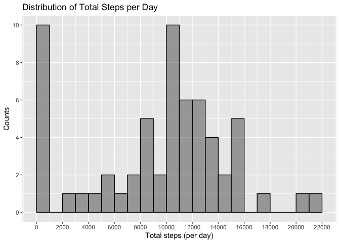
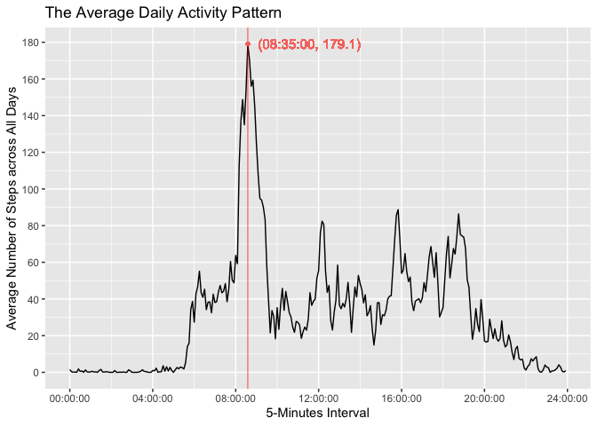
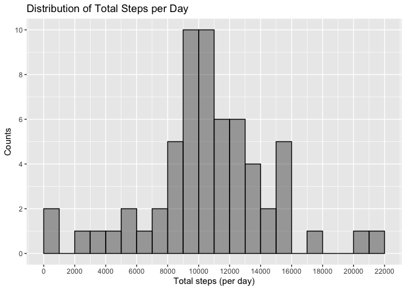
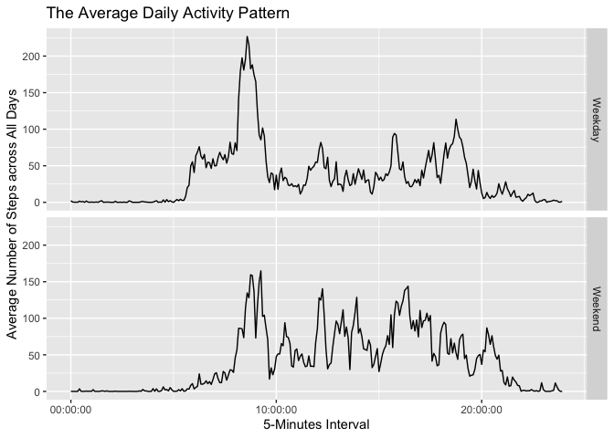

## Loading and preprocessing the data

### Unzip and read the data into R


```r
unzip("activity.zip")
activity <- read.csv("activity.csv")
```

### Check the data


```r
dim(activity)
```

```
## [1] 17568     3
```

```r
str(activity)
```

```
## 'data.frame':	17568 obs. of  3 variables:
##  $ steps   : int  NA NA NA NA NA NA NA NA NA NA ...
##  $ date    : chr  "2012-10-01" "2012-10-01" "2012-10-01" "2012-10-01" ...
##  $ interval: int  0 5 10 15 20 25 30 35 40 45 ...
```

```r
head(activity)
```

```
##   steps       date interval
## 1    NA 2012-10-01        0
## 2    NA 2012-10-01        5
## 3    NA 2012-10-01       10
## 4    NA 2012-10-01       15
## 5    NA 2012-10-01       20
## 6    NA 2012-10-01       25
```

### Convert the `date` varibale to `Date` format


```r
library(lubridate)
```

```
## 
## Attaching package: 'lubridate'
```

```
## The following objects are masked from 'package:base':
## 
##     date, intersect, setdiff, union
```

```r
activity$date <- ymd(activity$date)
str(activity)
```

```
## 'data.frame':	17568 obs. of  3 variables:
##  $ steps   : int  NA NA NA NA NA NA NA NA NA NA ...
##  $ date    : Date, format: "2012-10-01" "2012-10-01" ...
##  $ interval: int  0 5 10 15 20 25 30 35 40 45 ...
```


## What is mean total number of steps taken per day?

### Caluculate total number of steps taken per day


```r
library(dplyr)
```

```
## 
## Attaching package: 'dplyr'
```

```
## The following objects are masked from 'package:stats':
## 
##     filter, lag
```

```
## The following objects are masked from 'package:base':
## 
##     intersect, setdiff, setequal, union
```

```r
totalsteps_by_date <- activity %>% group_by(date) %>% summarise(total_steps = sum(steps, na.rm = TRUE))
```

```
## `summarise()` ungrouping output (override with `.groups` argument)
```

### Make the histogram


```r
library(ggplot2)
plot1 <- ggplot(totalsteps_by_date, aes(total_steps)) +
    geom_histogram(breaks = seq(0, 22000, by = 1000), col = "black", alpha = .5) + 
    scale_x_continuous(breaks = seq(0, 22000, by = 2000)) + 
    scale_y_continuous(breaks = seq(0, 10, by = 2)) + 
    labs(x = "Total steps (per day)", y = "Counts", title = "Distribution of Total Steps per Day")
plot1
```

<!-- -->


### Calculate the mean and median of the total number of steps taken per day


```r
mean <- round(mean(totalsteps_by_date$total_steps), 2)
median <- median(totalsteps_by_date$total_steps)
```

The **mean** of the total number of steps taken per day is **9354.23**.  

The **median** of the total number of steps taken per day is **10395**.  


## What is the average daily activity pattern?

### Convert the `interval` variable to `Time` format


```r
library(lubridate)
library(hms)
```

```
## 
## Attaching package: 'hms'
```

```
## The following object is masked from 'package:lubridate':
## 
##     hms
```

```r
activity$interval <- activity$interval * 100
activity$interval <- sprintf("%06d", activity$interval)
activity$interval <- format(strptime(activity$interval, format = "%H%M%S"), format = "%H:%M:%S")
activity$interval <- as_hms(activity$interval)
str(activity)
```

```
## 'data.frame':	17568 obs. of  3 variables:
##  $ steps   : int  NA NA NA NA NA NA NA NA NA NA ...
##  $ date    : Date, format: "2012-10-01" "2012-10-01" ...
##  $ interval: 'hms' num  00:00:00 00:05:00 00:10:00 00:15:00 ...
##   ..- attr(*, "units")= chr "secs"
```

### Calculate average daily steps by interval


```r
day_number <- length(unique(activity$date))
avesteps_by_interval <- activity %>% group_by(interval) %>% summarise(ave_steps = sum(steps, na.rm = TRUE)/day_number)
```

```
## `summarise()` ungrouping output (override with `.groups` argument)
```

### Calculate the interval with maximum of average daily steps


```r
ave_steps_max <- max(avesteps_by_interval$ave_steps)
interval_max <- avesteps_by_interval %>% filter(ave_steps == ave_steps_max)
interval_max
```

```
## # A tibble: 1 x 2
##   interval ave_steps
##   <time>       <dbl>
## 1 08:35         179.
```

### Make the plot


```r
plot2 <- ggplot(avesteps_by_interval, aes(interval, ave_steps)) + 
    geom_line() + 
    geom_vline(xintercept = as.numeric(interval_max[1, 1]), color = "red", alpha = .5) + 
    scale_x_time(breaks = c(as_hms("00:00:00"), as_hms("04:00:00"), as_hms("08:00:00"), as_hms("12:00:00"), 
                            as_hms("16:00:00"), as_hms("20:00:00"), as_hms("24:00:00"))) + 
    scale_y_continuous(breaks = seq(0, 200, by = 20)) + 
    labs(x = "5-Minutes Interval", y = "Average Number of Steps across All Days", 
         title = "The Average Daily Activity Pattern") + 
    geom_text(aes(x = as.numeric(interval_max[1, 1]), y = ave_steps_max, label = "(08:35:00, 179.1)", 
                  alpha = 0.5, color = "red"), hjust = -0.1, size = 4) + 
    theme(legend.position = "none") + 
    geom_point(aes(x = as.numeric(interval_max[1, 1]), y = ave_steps_max, color = "red", alpha = 0.5), size = 1)
plot2
```

<!-- -->


## Imputing missing values

### Check the number of `NAs` in `steps` variable


```r
sum(is.na(activity$steps))
```

```
## [1] 2304
```

### Join `avesteps_by_interval` into the `activity` data frame


```r
activity_fixed <- full_join(activity, avesteps_by_interval, by = "interval")
```

### Replace `NA` in `steps` with the value in `ave_steps`


```r
activity_fixed <- mutate(activity_fixed, steps = coalesce(steps, ave_steps))
```

### Re-check the number of `NAs` in `steps` variable


```r
sum(is.na(activity_fixed$steps))
```

```
## [1] 0
```

### Caluculate total number of steps taken per day


```r
totalsteps_by_date <- activity_fixed %>% group_by(date) %>% summarise(total_steps = sum(steps))
```

```
## `summarise()` ungrouping output (override with `.groups` argument)
```

### Make the plot


```r
plot3 <- ggplot(totalsteps_by_date, aes(total_steps)) +
    geom_histogram(breaks = seq(0, 22000, by = 1000), col = "black", alpha = .5) + 
    scale_x_continuous(breaks = seq(0, 22000, by = 2000)) + 
    scale_y_continuous(breaks = seq(0, 10, by = 2)) + 
    labs(x = "Total steps (per day)", y = "Counts", title = "Distribution of Total Steps per Day")
plot3
```

<!-- -->


### Calculate the mean and median of the total number of steps taken per day


```r
mean_n <- mean(totalsteps_by_date$total_steps)
median_n <- median(totalsteps_by_date$total_steps)
```

The **mean** of the total number of steps taken per day is **1.0581014\times 10^{4}**.  

The **median** of the total number of steps taken per day is **1.0395\times 10^{4}**.  


## Are there differences in activity patterns between weekdays and weekends?

### Create a new variable `weekdays`


```r
activity_fixed <- activity_fixed %>% mutate(weekdays = weekdays(date))
```

### Replace the values in weekdays to only "Weekday" or "Weekend"


```r
activity_fixed <- activity_fixed %>% mutate(weekdays = replace(weekdays, weekdays %in% c("Monday", "Tuesday", "Wednesday", "Thursday", "Friday"), "Weekday"))
activity_fixed <- activity_fixed %>% mutate(weekdays = replace(weekdays, weekdays %in% c("Saturday", "Sunday"), "Weekend"))
table(activity_fixed$weekdays)
```

```
## 
## Weekday Weekend 
##   12960    4608
```

### Convert `weekdays` to factor variable


```r
activity_fixed <- activity_fixed %>% mutate(weekdays = factor(weekdays))
```

### Calculate number of days in the Weekday and Weekend


```r
by_weekdays <- group_by(activity_fixed, weekdays)
no_weekdays <- summarise(by_weekdays, length(unique(date)))
```

```
## `summarise()` ungrouping output (override with `.groups` argument)
```

```r
no_weekdays
```

```
## # A tibble: 2 x 2
##   weekdays `length(unique(date))`
##   <fct>                     <int>
## 1 Weekday                      45
## 2 Weekend                      16
```

### Calculate average steps by interval and weekdays


```r
totalSteps_by_weekdays_interval <- activity_fixed %>% group_by(weekdays, interval) %>% summarise(total_steps = sum(steps))
```

```
## `summarise()` regrouping output by 'weekdays' (override with `.groups` argument)
```

```r
aveSteps_by_weekdays_interval <- mutate(totalSteps_by_weekdays_interval, if (weekdays == "Weekday") {
    ave_steps = total_steps/45} else 
    {ave_steps = total_steps/16} 
)
```

```
## Warning: Problem with `mutate()` input `..1`.
## ℹ the condition has length > 1 and only the first element will be used
## ℹ Input `..1` is `if (...) NULL`.
## ℹ The error occurred in group 1: weekdays = "Weekday".
```

```
## Warning in if (weekdays == "Weekday") {: the condition has length > 1 and only
## the first element will be used
```

```
## Warning: Problem with `mutate()` input `..1`.
## ℹ the condition has length > 1 and only the first element will be used
## ℹ Input `..1` is `if (...) NULL`.
## ℹ The error occurred in group 2: weekdays = "Weekend".
```

```
## Warning in if (weekdays == "Weekday") {: the condition has length > 1 and only
## the first element will be used
```

```r
colnames(aveSteps_by_weekdays_interval) <- c("weekdays", "interval", "total_steps", "ave_steps")
```

### Make the plot


```r
plot4 <- ggplot(aveSteps_by_weekdays_interval, aes(interval, ave_steps)) + 
    geom_line() + 
    facet_grid(weekdays ~.) +
    labs(x = "5-Minutes Interval", y = "Average Number of Steps across All Days", 
         title = "The Average Daily Activity Pattern")
plot4
```

<!-- -->

